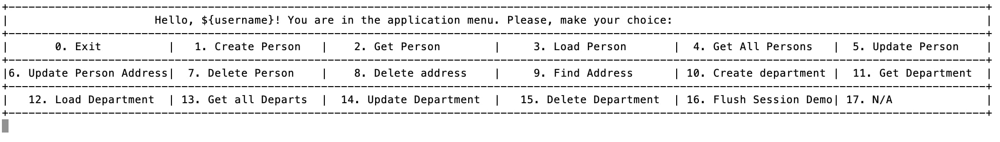

# person-registry 

This simple console application dedicated & implemented to learn the abilities of hibernate framework.
This project was developed during study in <a href="https://www.it-academy.by">IT-Academy</a> as a training project to learn hibernate framework during java course.
Then lately it was reworked and refactored, keeping the general business idea of the app untouched.

This is a console application, that allows user to manage Person entity, and it's related entities: Address & Department.

System name: **person-registry**

### Getting Started
To run the application, first you need to checkout [winter-io](https://github.com/cyberalexander/winter-io) framework and successfully compile it locally.
As this application based on [winter-io](https://github.com/cyberalexander/winter-io) framework.

build:
```bash
$ mvn -U clean install
$ java -jar target/person-registry.jar
```


### Tech stack:
- Java 17
- Maven
- Hibernate 5.X
- MySQL 8.X
- JUnit 5
- Lombok
- PMD, CheckStyle
- JaCoCo
- [winter-io](https://github.com/cyberalexander/winter-io) custom framework